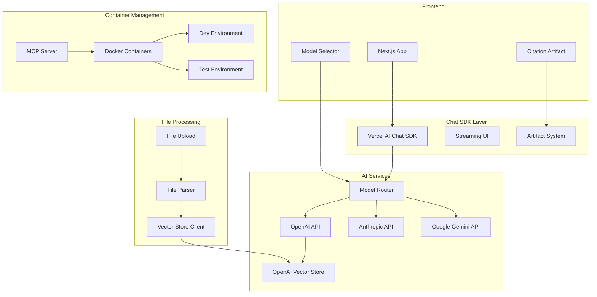

# RAG Chat Application PRD with Vertical Slices (June 2025)

## 🎯 Project Overview

Build a production-ready RAG chat application in TypeScript using vercel/ai-chatbot as the foundation, with custom artifacts for citation display, multi-model support (OpenAI, Anthropic, Google), and containerized development using MCP (Model Context Protocol).

### Core Technologies
- **Framework**: Next.js 14+ with vercel/ai-chatbot
- **Models**: GPT-4.1, o4-mini, Claude 4, Gemini 2.5 Pro/Flash
- **Vector Store**: OpenAI Vector Store API (built-in file search)
- **Runtime**: Bun for performance
- **Testing**: Playwright + Stagehand
- **Containerization**: MCP (Model Context Protocol) with container-use server
- **UI**: shadcn/ui components with custom artifacts

## 📐 Architecture Diagram



## 🔧 Initial Setup & Configuration

### Makefile
```makefile
# Makefile
.PHONY: setup dev test build clean mcp-setup

PORTS = 3000 3001 3002 6379 5432

# Kill ports before running
kill-ports:
	@for port in $(PORTS); do \
		lsof -ti:$port | xargs kill -9 2>/dev/null || true; \
	done

setup: kill-ports mcp-setup
	@echo "🚀 Setting up RAG Chat App..."
	git clone https://github.com/vercel/ai-chatbot.git rag-chat
	cd rag-chat && bun install
	cd rag-chat && bunx shadcn-ui@latest init -y
	cd rag-chat && bun add zod

mcp-setup:
	@echo "🐳 Setting up MCP container server..."
	npm install -g @dagger.io/mcp-server-container-use
	@echo "✅ MCP server installed. Configure Claude Desktop settings."

dev: kill-ports
	cd rag-chat && docker-compose up -d
	cd rag-chat && bun dev

dev-local: kill-ports
	cd rag-chat && bun dev

test: kill-ports
	cd rag-chat && docker-compose run test

test-e2e: kill-ports
	cd rag-chat && docker-compose run e2e

build:
	cd rag-chat && docker-compose build
	cd rag-chat && bun run build

clean: kill-ports
	cd rag-chat && docker-compose down -v
	rm -rf rag-chat
```

### Environment Configuration
```env
# .env.local
# OpenAI (for GPT-4.1, o4-mini, and Vector Store)
OPENAI_API_KEY=your-key-here

# Anthropic (for Claude 4)
ANTHROPIC_API_KEY=your-key-here

# Google (for Gemini 2.5)
GOOGLE_API_KEY=your-key-here

# Vector Store
OPENAI_VECTORSTORE_ID=vs_your_id_here

# App Config
NEXT_PUBLIC_APP_URL=http://localhost:3000
```

## 📋 Vertical Slices Implementation

### Slice 1: Project Foundation & Model Integration
**What You're Building**: Set up the base project with multi-model support and model selection UI

#### Tasks

##### 1.1 Initialize Project Structure
- Complexity: 2
- [ ] Clone vercel/ai-chatbot
- [ ] Run setup script with Bun
- [ ] Configure TypeScript strict mode
- [ ] Set up environment variables
- [ ] Write test for environment loading
- [ ] Test passes locally

##### 1.2 Implement Multi-Model Provider
- Complexity: 3
- [ ] Create model provider abstraction
- [ ] Implement OpenAI provider (GPT-4.1, o4-mini)
- [ ] Implement Anthropic provider (Claude 4)
- [ ] Implement Google provider (Gemini 2.5 Pro/Flash)
- [ ] Write tests for each provider
- [ ] Test passes locally

**Subtask 1.2.1:** Provider Interface - Complexity: 2
**Subtask 1.2.2:** Provider Factory - Complexity: 1

##### 1.3 Create Model Selection UI
- Complexity: 2
- [ ] Install shadcn/ui Combobox component
- [ ] Create ModelSelector component
- [ ] Connect to model provider
- [ ] Add model metadata display
- [ ] Write Playwright test
- [ ] Test passes locally

#### Code Example
```typescript
// app/lib/models/provider.ts
export interface ModelProvider {
  id: string;
  name: string;
  models: ModelConfig[];
  chat(params: ChatParams): Promise<StreamingTextResponse>;
}

// app/components/model-selector.tsx
export function ModelSelector() {
  const [selectedModel, setSelectedModel] = useState<string>('gpt-4.1');
  
  return (
    <Combobox
      value={selectedModel}
      onValueChange={setSelectedModel}
      options={availableModels}
    />
  );
}
```

#### Ready to Merge Checklist
- [ ] All tests pass (bun test)
- [ ] Linting passes (bun run lint)
- [ ] Build succeeds (bun run build)
- [ ] Model switching works in UI
- [ ] Feature branch: `feature/multi-model-support`

**Quick Research**: [Vercel AI SDK Providers](https://sdk.vercel.ai/providers/overview)

---

### Slice 2: OpenAI Vector Store Integration
**What You're Building**: File upload system with OpenAI's vector store for document search

#### Tasks

##### 2.1 Implement File Upload Handler
- Complexity: 3
- [ ] Create file upload API route
- [ ] Add file validation (size, type)
- [ ] Handle multiple file uploads
- [ ] Store file references
- [ ] Write upload tests
- [ ] Test passes locally

**Subtask 2.1.1:** File validation utility - Complexity: 1
**Subtask 2.1.2:** Upload progress tracking - Complexity: 2

##### 2.2 Vector Store File Processing
- Complexity: 4
- [ ] Create OpenAI vector store if not exists
- [ ] Upload files to OpenAI Files API
- [ ] Add files to vector store
- [ ] Poll for processing completion
- [ ] Write integration tests
- [ ] Test passes locally

**Subtask 2.2.1:** Vector store client wrapper - Complexity: 2
**Subtask 2.2.2:** Processing status component - Complexity: 2

##### 2.3 File Search Tool Integration
- Complexity: 3
- [ ] Create file search tool definition
- [ ] Integrate with chat completion
- [ ] Handle search results in UI
- [ ] Display file citations
- [ ] Write E2E tests
- [ ] Test passes locally

#### Code Example
```typescript
// app/api/files/upload/route.ts
export async function POST(req: Request) {
  const formData = await req.formData();
  const files = formData.getAll('files');
  
  // Upload to OpenAI
  const uploadedFiles = await Promise.all(
    files.map(file => 
      openai.files.create({
        file: file,
        purpose: 'assistants'
      })
    )
  );
  
  // Add to vector store
  await openai.vectorStores.files.createBatch(
    process.env.OPENAI_VECTORSTORE_ID!,
    { file_ids: uploadedFiles.map(f => f.id) }
  );
  
  return Response.json({ success: true });
}
```

#### Ready to Merge Checklist
- [ ] File upload works
- [ ] Vector store processes files
- [ ] Search returns results
- [ ] Tests pass
- [ ] Feature branch: `feature/vector-store-integration`

**Quick Research**: [OpenAI Vector Stores Guide](https://platform.openai.com/docs/assistants/tools/file-search)

---

### Slice 3: Custom Citation Artifact
**What You're Building**: Split-view UI showing chat responses with inline citations and source sidebar

#### Tasks

##### 3.1 Create Citation Artifact Component
- Complexity: 4
- [ ] Design citation data structure
- [ ] Build split-view layout
- [ ] Create citation extraction logic
- [ ] Implement citation highlighting
- [ ] Write component tests
- [ ] Test passes locally

**Subtask 3.1.1:** Citation parser - Complexity: 2
**Subtask 3.1.2:** Split view responsive design - Complexity: 2

##### 3.2 Integrate with Chat SDK
- Complexity: 3
- [ ] Extend artifact types
- [ ] Create citation artifact handler
- [ ] Connect to streaming UI
- [ ] Handle real-time updates
- [ ] Write integration tests
- [ ] Test passes locally

##### 3.3 Source Preview Feature
- Complexity: 2
- [ ] Create source preview modal
- [ ] Add hover interactions
- [ ] Implement source navigation
- [ ] Add citation statistics
- [ ] Write Playwright tests
- [ ] Test passes locally

#### Code Example
```typescript
// app/components/artifacts/citation-artifact.tsx
export function CitationArtifact({ 
  content, 
  citations 
}: CitationArtifactProps) {
  return (
    <div className="grid grid-cols-[1fr,300px] gap-4">
      <div className="prose">
        <AnnotatedContent 
          content={content} 
          citations={citations}
          onCitationClick={handleCitationClick}
        />
      </div>
      <aside className="border-l pl-4">
        <CitationSidebar citations={citations} />
      </aside>
    </div>
  );
}
```

#### Ready to Merge Checklist
- [ ] Citation UI renders correctly
- [ ] Citations link to sources
- [ ] Responsive on mobile
- [ ] All tests pass
- [ ] Feature branch: `feature/citation-artifact`

**Quick Research**: [Chat SDK Artifacts](https://chat-sdk.dev/docs/customization/artifacts)

---

### Slice 4: Container Management with MCP
**What You're Building**: Container orchestration using the container-use MCP for isolated development environments

#### Tasks

##### 4.1 Set Up Container-Use MCP
- Complexity: 2
- [ ] Install container-use MCP server
- [ ] Configure MCP in Claude Desktop settings
- [ ] Set up container definitions
- [ ] Test MCP connection
- [ ] Write setup documentation
- [ ] Test passes locally

##### 4.2 Create Container Environments
- Complexity: 3
- [ ] Define development container spec
- [ ] Configure test container environment
- [ ] Set up database containers
- [ ] Implement container lifecycle management
- [ ] Write container tests
- [ ] Test passes locally

**Subtask 4.2.1:** Container networking setup - Complexity: 2
**Subtask 4.2.2:** Volume persistence config - Complexity: 1

##### 4.3 Integrate MCP with Development Workflow
- Complexity: 3
- [ ] Create MCP commands for common tasks
- [ ] Set up hot reload in containers
- [ ] Configure debugging support
- [ ] Add health check endpoints
- [ ] Write integration tests
- [ ] Test passes locally

#### Code Example
```typescript
// mcp-config.json
{
  "mcpServers": {
    "container-use": {
      "command": "npx",
      "args": ["@dagger.io/mcp-server-container-use"],
      "env": {
        "DOCKER_HOST": "unix:///var/run/docker.sock"
      }
    }
  }
}

// container-definitions.ts
export const containers = {
  development: {
    name: "rag-chat-dev",
    image: "oven/bun:1.0-alpine",
    volumes: [
      "./:/app",
      "node_modules:/app/node_modules"
    ],
    ports: ["3000:3000"],
    environment: {
      NODE_ENV: "development"
    }
  },
  testing: {
    name: "rag-chat-test",
    image: "mcr.microsoft.com/playwright:v1.42.0",
    volumes: ["./:/app"],
    environment: {
      NODE_ENV: "test"
    }
  }
};
```

#### Ready to Merge Checklist
- [ ] MCP server installed and configured
- [ ] Containers start via MCP commands
- [ ] Development workflow documented
- [ ] All tests pass in containers
- [ ] Feature branch: `feature/mcp-containers`

**Quick Research**: [MCP Container-Use Server](https://github.com/dagger/container-use) | [MCP Protocol Docs](https://modelcontextprotocol.io/)

---

### Slice 5: TDD Testing Suite
**What You're Building**: Comprehensive test suite with Playwright and Stagehand for E2E testing

#### Tasks

##### 5.1 Set Up Playwright with Stagehand
- Complexity: 2
- [ ] Install Playwright and Stagehand
- [ ] Configure test environment
- [ ] Create test helpers
- [ ] Set up test data
- [ ] Write setup tests
- [ ] Test passes locally

##### 5.2 Create RAG-Specific Test Utilities
- Complexity: 4
- [ ] Build semantic similarity matcher
- [ ] Create citation validator
- [ ] Add streaming response tester
- [ ] Implement model mock system
- [ ] Write utility tests
- [ ] Test passes locally

**Subtask 5.2.1:** Semantic test helpers - Complexity: 2
**Subtask 5.2.2:** Mock response builder - Complexity: 2

##### 5.3 Write Comprehensive E2E Tests
- Complexity: 3
- [ ] Test chat flow end-to-end
- [ ] Test file upload and search
- [ ] Test citation interactions
- [ ] Test model switching
- [ ] All tests pass
- [ ] Test passes locally

#### Code Example
```typescript
// tests/e2e/rag-chat.spec.ts
test('should generate response with citations', async ({ page }) => {
  // Use Stagehand for intelligent element selection
  await page.observe('Upload a document about AI');
  await page.act('Click the upload button');
  
  // Upload test document
  await page.setInputFiles('[data-testid="file-input"]', 
    'tests/fixtures/ai-guide.pdf'
  );
  
  // Wait for processing
  await expect(page.locator('[data-testid="processing-status"]'))
    .toContainText('Complete');
  
  // Test RAG response
  await page.fill('[data-testid="chat-input"]', 
    'What are the key principles of AI?'
  );
  await page.keyboard.press('Enter');
  
  // Verify citations appear
  const citations = page.locator('[data-testid="citation"]');
  await expect(citations).toHaveCount(3, { timeout: 10000 });
});
```

#### Ready to Merge Checklist
- [ ] All E2E tests pass
- [ ] Test coverage > 80%
- [ ] CI pipeline green
- [ ] Performance benchmarks met
- [ ] Feature branch: `feature/testing-suite`

**Quick Research**: [Playwright Best Practices](https://playwright.dev/docs/best-practices)

---

### Slice 6: Git Worktrees Workflow
**What You're Building**: Parallel development setup using Git worktrees

#### Tasks

##### 6.1 Create Worktree Setup Script
- Complexity: 2
- [ ] Write worktree initialization script
- [ ] Add branch management
- [ ] Create environment sync
- [ ] Add cleanup utilities
- [ ] Test script works
- [ ] Documentation complete

##### 6.2 Configure Parallel Development
- Complexity: 2
- [ ] Set up feature worktrees
- [ ] Configure isolated environments
- [ ] Add worktree aliases
- [ ] Create merge workflow
- [ ] Test workflow
- [ ] Document process

#### Code Example
```bash
#!/bin/bash
# scripts/setup-worktrees.sh

# Create worktrees for parallel development
create_worktree() {
  local branch=$1
  local name=$2
  
  git worktree add ../$name -b $branch
  cd ../$name
  cp ../${PWD##*/}/.env.local .env.local
  bun install
  echo "✅ Worktree '$name' created for branch '$branch'"
}

# Set up all feature worktrees
create_worktree "feature/model-integration" "rag-models"
create_worktree "feature/citations" "rag-citations"
create_worktree "feature/testing" "rag-testing"
```

#### Ready to Merge Checklist
- [ ] Worktree scripts work
- [ ] Documentation complete
- [ ] Team trained on workflow
- [ ] CI supports worktrees
- [ ] Feature branch: `feature/worktree-workflow`

**Quick Research**: [Git Worktree Guide](https://git-scm.com/docs/git-worktree)

---

## 🚀 Getting Started

### For Junior Developers

1. **Initial Setup**:
   ```bash
   make setup
   make dev
   ```

2. **Start with Slice 1**: Foundation and model integration
3. **Use provided research prompts** when stuck
4. **Run tests frequently**: `bun test --watch`
5. **Ask for help** on complexity 4-5 tasks

### Research Prompt Template
*"I'm implementing [describe your slice] using [technology stack]. What are the key concepts I should understand, common pitfalls to avoid, and best practices? Please explain with code examples suitable for a junior developer."*

## 📊 Complexity Guidelines

- **1-2**: Follow existing patterns, minor changes
- **3**: New feature, requires reading documentation
- **4-5**: Complex integration, pair with senior developer

## 🎯 Definition of Done

Each slice is complete when:
- [ ] All unit tests pass
- [ ] E2E tests pass
- [ ] Code reviewed and approved
- [ ] Documentation updated
- [ ] Merged to main with conventional commit
- [ ] Deployed to staging environment

## 📚 Key Resources

- [Vercel AI SDK Docs](https://sdk.vercel.ai/docs)
- [OpenAI Responses API](https://platform.openai.com/docs/api-reference/responses)
- [Dagger Documentation](https://docs.dagger.io/)
- [Playwright + Stagehand Guide](https://github.com/browserbase/stagehand)
- [Git Worktrees Tutorial](https://www.atlassian.com/git/tutorials/git-worktree)